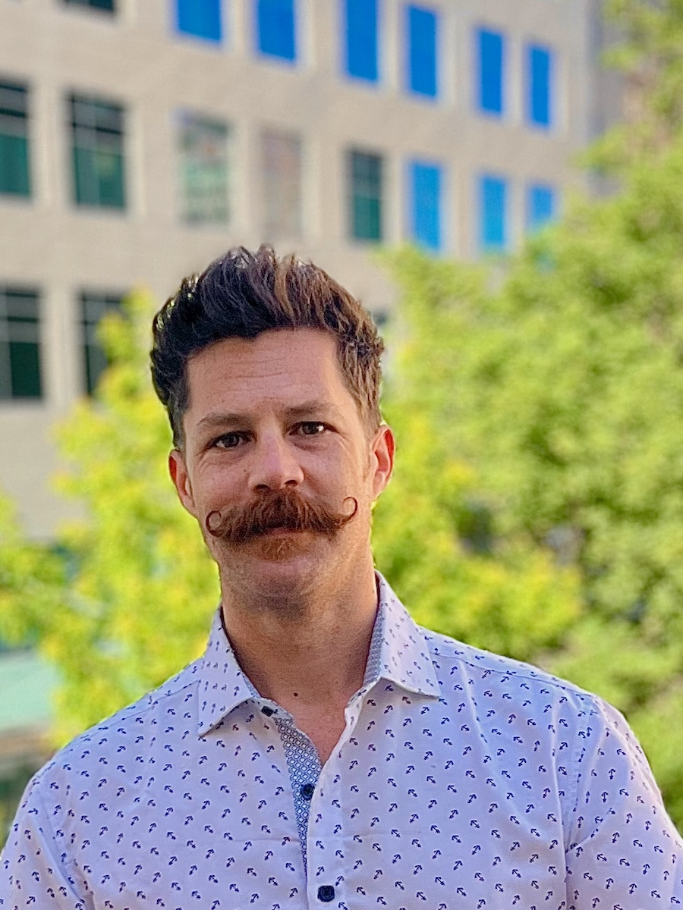
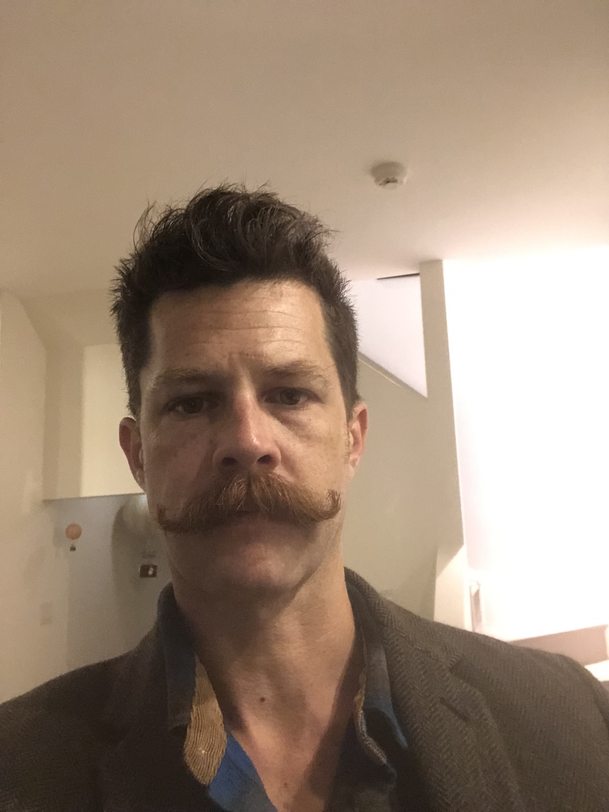
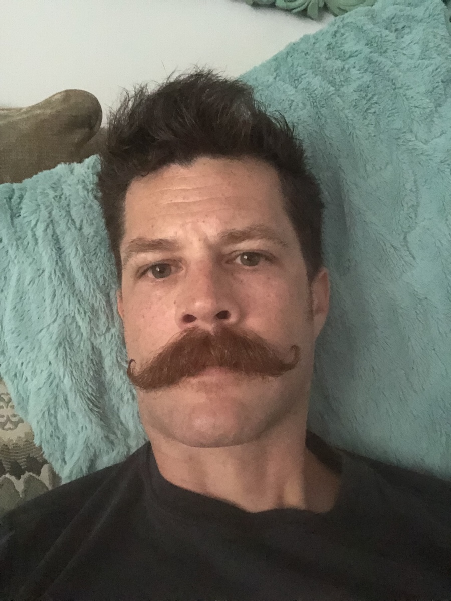
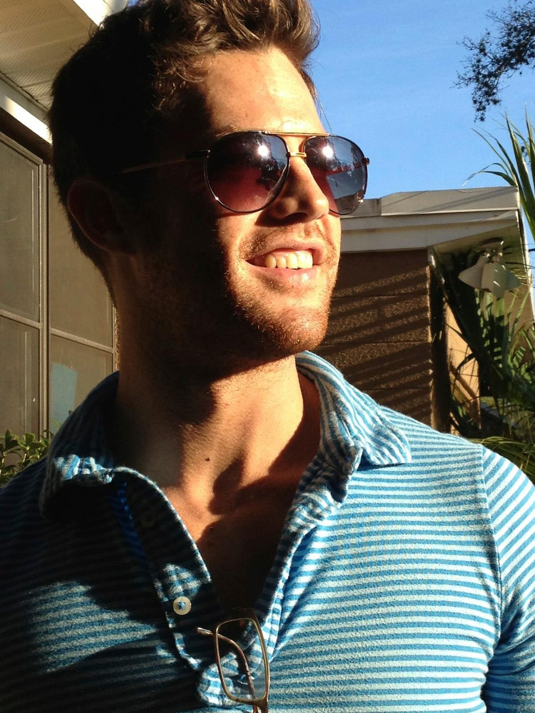
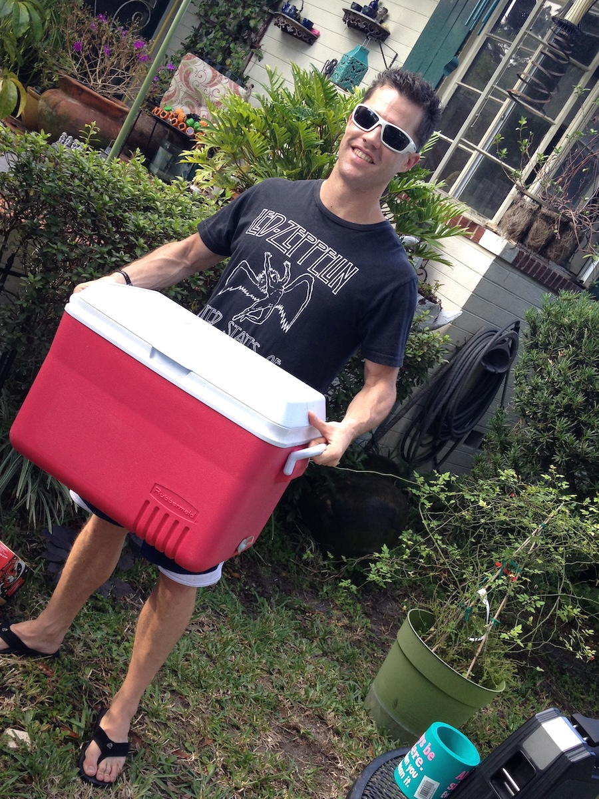
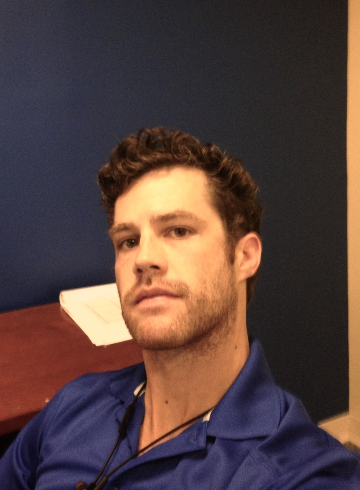
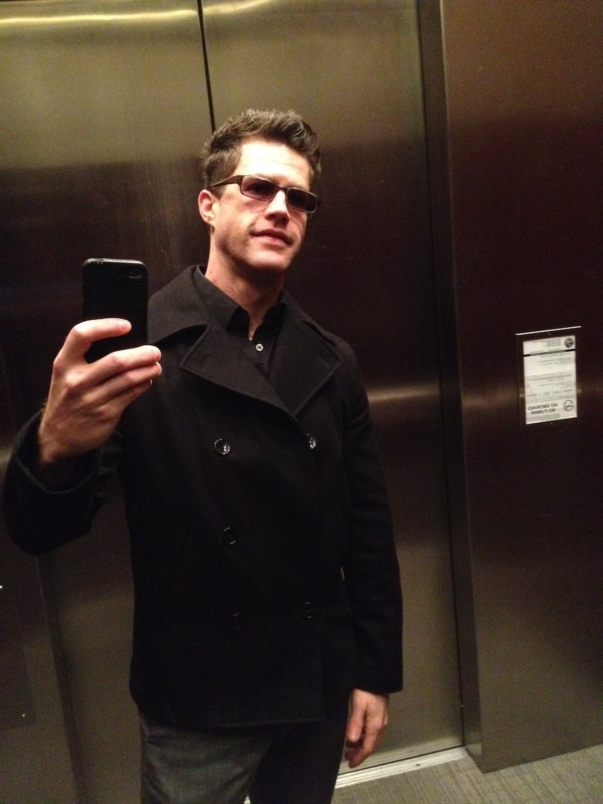
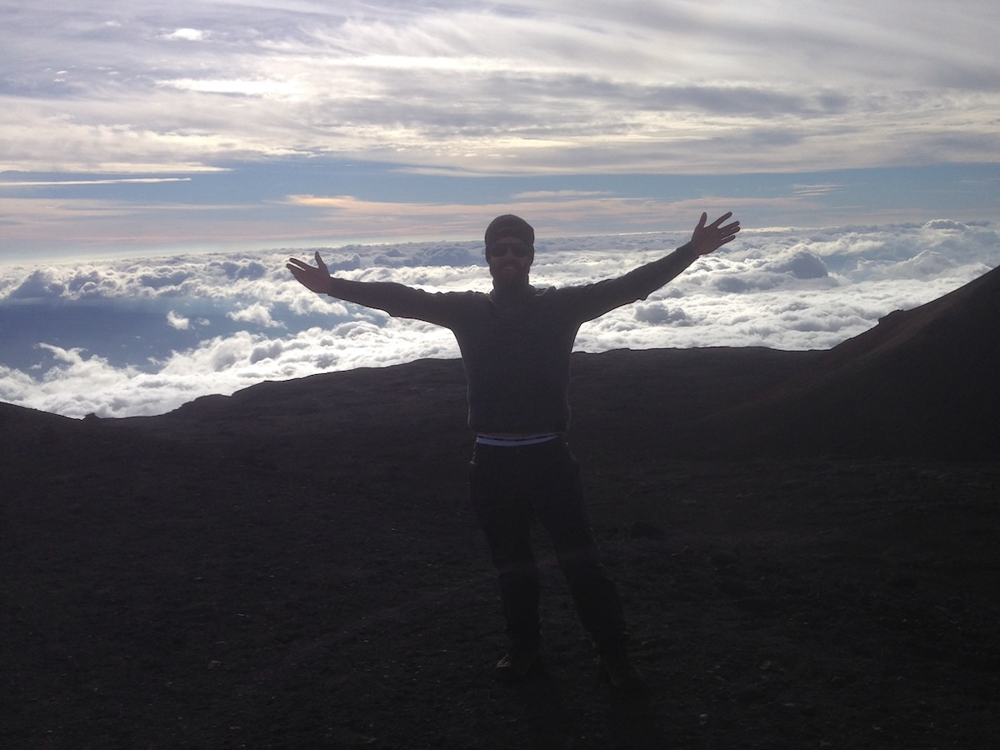

# Andrew Haller

## Nice to meet you

- I currently live in Naperville, Illinois (Chicago suburb)

- When not working, I enjoy fitness, gardening, baking, and cooking. I mostly grow heirloom tomatoes, cucumbers, carrots, onions, lot's of herbs, and a variety of peppers and hot peppers.

- One of my favorite ways to decompress is going for a 5 mile run, in the hot sun, listening to music.

- I prefer driving a manual car, and currently drive a Mustang.

- I'm pretty introverted, so I also enjoy staring at a wall and imagining what life would be like on a planet with no other people.

- I have a large dog -- a Belgian Malinois -- who's about 12 years old, and cat who's about about 11. I also have a small Yorkie mix who's about 11 years old.

- I used to live in Orlando, Florida (and did most of my life). In my mid 20s, I played a variety of instruments -- including harmonica, the jaw harp (jew’s harp), and some fiddle -- in a Florida-swampy-bluegrassy-folk style band for 5 years. The band was called "The Token Gamblers".

## A few of my favorite things

- My favorite book, which I've read numerous times, is Plato’s "Republic".

- My favorite movie is "2001: A Space Odyssey" (Kubrick).

- My favorite tv show is Seinfeld.

- My favorite rock album is David Bowie's "Ziggy Stardust" ("The Rise and Fall of Ziggy Stardust and the Spiders from Mars"). Dark side of the Moon (Pink Floyd) is probably a close tie.

- My favorite music to listen to when I work is older electronic (e.g. Tangerine Dream) and progressive trance and house (DJ Tiesto, Paul Oakenfold, Paul van Dyk, Sander Kleinenberg, ...), with some newer stuff mixed in (Solar Fields, Suduaya, Daft Punk, ...).

## So long, and thanks for all the fish

